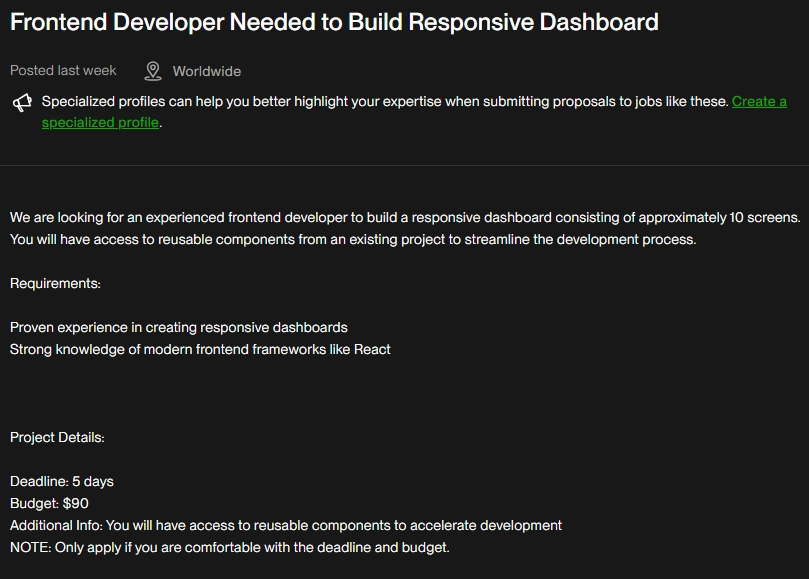

# Responsive Dashboard with Dash
## Project info:


## Requirements
- Python 3.8+
- Required libraries (Install using `pip install -r requirements.txt`)

## Setup Instructions
1. Clone the repository.
2. Install dependencies:
   ```
   pip install -r requirements.txt
   ```
3. Run the app:
   ```
   python app.py
   ```
4. Access the app at `http://127.0.0.1:8050`.

## Features
- Responsive layout
- Modularized code for scalability
- Placeholder components for easy customization
        